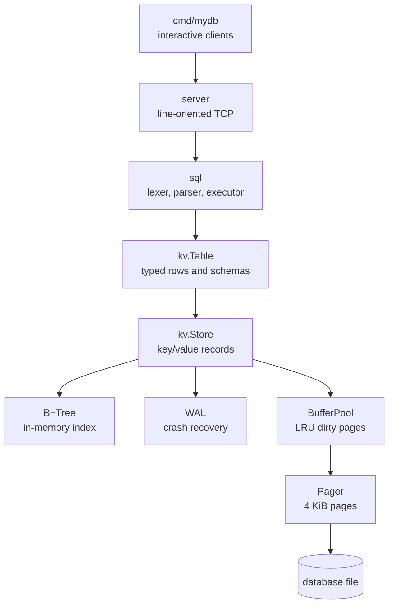
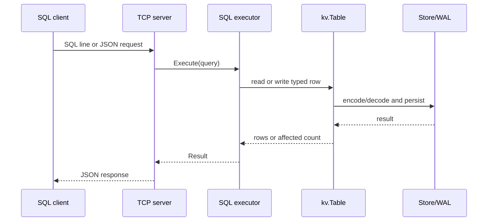

# mydb

`mydb` is a small database engine written in Go. It is a learning project with
working storage, indexing, typed tables, SQL, durability, and a TCP interface.

## What is implemented

- Fixed-size 4 KiB pages and a pager backed by a database file (`storage/`).
- An LRU buffer pool with dirty-page flushing (`storage/buffer_pool.go`).
- An append-only key/value store with tombstones, an in-memory B+Tree index,
  and write-ahead logging (`kv/`).
- Typed rows and schemas supporting `int`, `string`, and `bool` (`kv/table.go`).
- A small SQL lexer, parser, and executor supporting `SELECT`, `INSERT`,
  boolean and comparison `WHERE` expressions, `EXPLAIN`, and `SHOW TABLES`/`LIST TABLES` (`sql/`).
- Backup and restore commands that snapshot the database file and its WAL sidecar (`kv/`, `cmd/mydb/`).
- A line-oriented TCP server accepting plain SQL or JSON requests (`server/`).
- Interactive key/value and SQL clients (`cmd/mydb/`).

## Architecture



## Request flow



## On-disk format

Each page is 4 KiB. Its header stores the page ID, the next-page pointer, and
the offset where the next record can be appended. Records contain a live or
tombstone flag, key/value lengths, and the key/value bytes. Updates append a
new record; reads use the rebuilt B+Tree to find the latest live value.

The WAL is stored beside the database file. Writes are logged and synced before
the corresponding page changes. On startup, complete WAL records are replayed;
a clean close checkpoints the log.

## Run it

```bash
go build ./...
go test ./...

# Start the SQL server (uses seed.sql when present)
make start

# In another terminal, connect with the SQL client
make sql
```

The server can also be started directly:

```bash
go run ./cmd/mydb server --db mydb.db --addr :5433 --seed seed.sql
go run ./cmd/mydb sql --addr :5433

# Snapshot or restore a database and its sibling .wal file
go run ./cmd/mydb backup mydb.db mydb.backup
go run ./cmd/mydb restore mydb.backup mydb.db
```

The SQL client prints result sets as aligned tables:

```text
+----+-------+--------+
| id | name  | active |
+----+-------+--------+
| 1  | Alice | true   |
+----+-------+--------+
```

The key/value shell is available with `go run ./cmd/mydb path/to/file.db` and
supports `put`, `get`, `delete`, and `exit`.

## Project layout

```text
mydb/
├── cmd/mydb/main.go       # key/value shell, SQL client, and server command
├── kv/
│   ├── btree.go           # in-memory B+Tree index
│   ├── store.go           # append-only records and store operations
│   ├── table.go           # typed schemas and rows
│   └── wal.go             # write-ahead log and recovery
├── server/server.go       # newline-delimited TCP/JSON protocol
├── sql/sql.go             # SQL lexer, parser, and executor
├── storage/
│   ├── buffer_pool.go     # LRU page cache
│   ├── page.go            # page representation and layout
│   └── pager.go           # database-file page I/O
├── seed.sql               # optional startup seed data
├── Makefile
└── README.md
```

## References

- *Database Internals* by Alex Petrov
- [CMU Intro to Database Systems](https://www.youtube.com/@cmudatabasegroup)
- [BoltDB](https://github.com/etcd-io/bbolt) and [Badger](https://github.com/dgraph-io/badger)
- [Let's Build a Simple Database](https://cstack.github.io/db_tutorial/)
